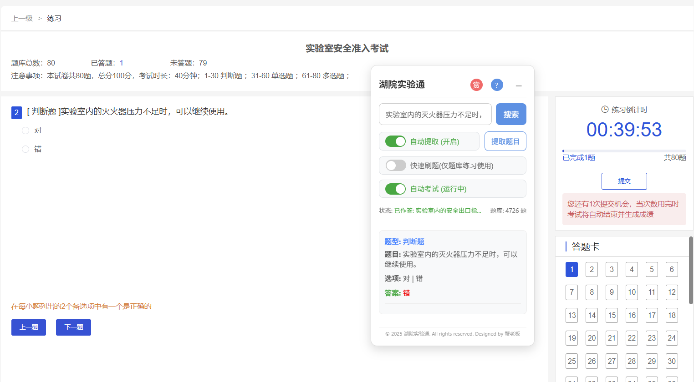

# 湖院实验通 (HZC LibTong)


> 专为湖州学院实验室准入考试设计的题库搜索工具

## 01 功能简介

湖院实验通（HZC LibTong）是一款浏览器扩展，可在指定网站上提供悬浮式题库搜索功能，帮助用户快速查找实验室安全准入考试的相关题目和答案。


### 核心功能

- **智能搜索**：支持关键词模糊匹配，实时显示题目、选项和答案
- **自动提取**：可自动识别当前页面题目并搜索答案
- **快速刷题**：自动随机选择答案并跳转下一题
- **自动考试**：自动匹配题目并选择正确答案
- **简洁界面**：现代化设计，提升用户体验

## 02 安装步骤

1. 下载/克隆项目到本地 ([下载链接（点我）：HZC_LibTong.zip](https://github.com/Whale-Yu/HZC-LibTong/releases/download/V1.0/HZC_LibTong.zip))
2. 打开 Chrome 浏览器，搜索框输入： `chrome://extensions/`  （或者点击插件图标 -> 管理扩展程序） 
3. 开启开发者模式 
4. 点击"加载已解压的扩展程序"
5. 选择解压好的 `HZC_LibTong` 文件夹（选择最里面的文件夹）

注：Edge浏览器安装步骤类似；其他浏览器未经测试

## 03 使用方法
1. 访问 [实验室管理系统](https://zysys.zjhzu.edu.cn/aqzr.html#/Onlinelearning/List) ，并完成登录
2. 页面右上角会出现悬浮窗
3. 输入关键词进行搜索，或使用自动功能

注：自动考试最后需手动提交，请自行完成（并注意可适当错1-2题）

## 04 打赏支持
如果本工具对您有帮助或带来方便，欢迎打赏支持：


## 06 项目结构

```
HZC_LibTong/
├── HZC_LibTong/           # Chrome扩展主目录
│   ├── manifest.json      # 扩展配置文件
│   ├── content.js         # 主要功能实现
│   ├── floating.css       # 悬浮窗样式
│   ├── questions.json     # 题库数据
│   ├── instructions.html  # 使用说明
│   └── icon.png           # 扩展图标
└── README.md              # 项目说明文档
```

## 07 免责声明

本工具仅供学习交流使用，旨在帮助湖州学院学生更好地复习实验室安全相关知识。使用者应遵守所在学校及国家的相关法律法规，不得将此工具用于任何违反规定或不道德的行为。开发者不对因使用本工具而产生的任何直接或间接后果承担责任。

使用本工具即表示您同意：
- 仅将其作为学习辅助工具，不依赖其进行实际考试作弊
- 遵守学校关于实验室准入考试的所有规定
- 理解并接受使用此类工具可能带来的学术诚信风险
- 自行承担使用本工具的所有责任和风险

## 08 支持与反馈
如果您发现任何问题、改进建议、题库更新（发现加载的题库数量≠题库练习里的所有题目数量，请提issue或联系作者）
- 开发者： 蟹老板 (v：tinyfisher19)

## 09 参考
正式版的多选答题逻辑参考了以下开源项目，感谢 [himwei](https://gitee.com/himwei) 的开源贡献：[script.js](https://gitee.com/himwei/huzhou-university-laboratory-test/blob/master/script.js)

## 10 许可证
本项目采用 MIT 许可证，详情请参见 [LICENSE](LICENSE) 文件。
